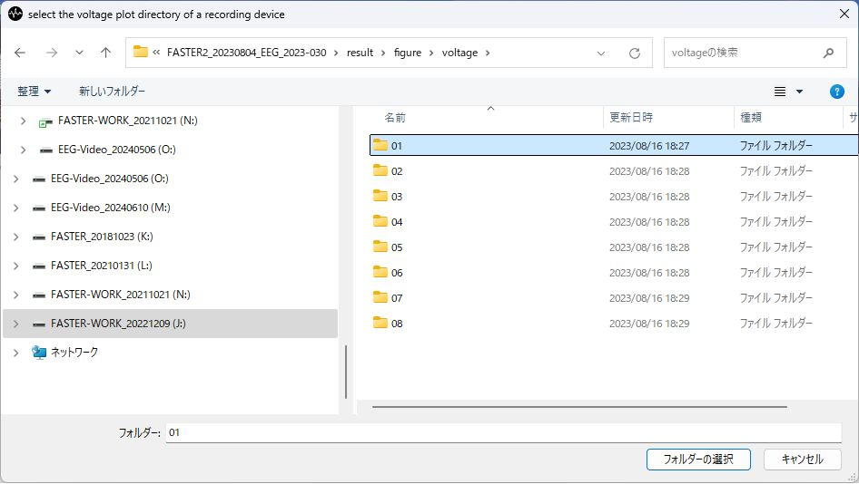
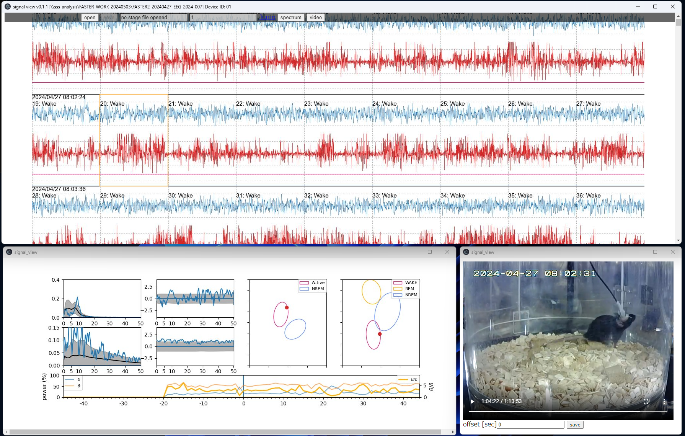
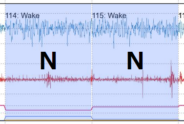
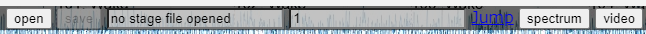
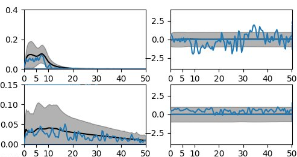
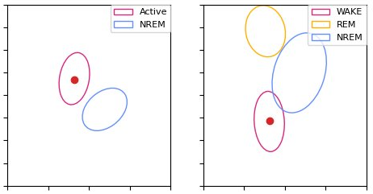
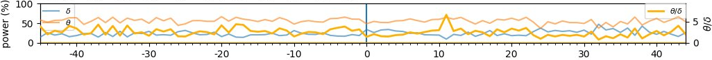
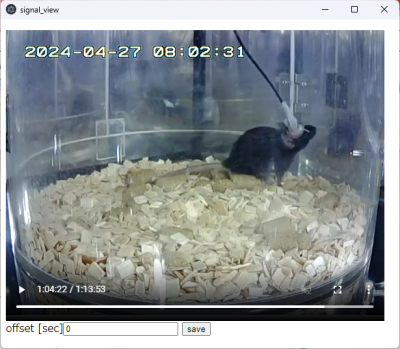

## What is it?
**signal view** is a simple visual tool to see and manually correct sleep stages given by [FASTER2](https://github.com/OrganismalSystemsBiology/faster2). 

## Main features
- Visualize time series data of the normalized EEG/EMG voltages along with sleep stages (REM, NREM, and Wake).
- Edit & Save & Load sleep stage annotations.
- View FFT spectrum and video clip corresponding to the epoch under the inspection

## Where to download it

You can download release versions at:
https://github.com/OrganismalSystemsBiology/signal_view/releases

Or the development version is available at:
https://github.com/OrganismalSystemsBiology/signal_view

## Installation
You can just download the installer (signal_view.Setup.*.*.*.exe) from the releases page and run it.

## How to use
There are three steps to use signal_view.

* Load the EEG/EMG voltage figures
* Edit the sleep stages
* Save the edited sleep stages

### Load the voltage data
When you launch the **signal_view** you see the dialog window to select the voltage plot folder in the folder of `result/figure/voltage/` made by FASTER2. 

*Note*: Select a voltage plot folder corresponding to the channel you are going to inspect.

### Edit the sleep stages
After a couple of minutes of loading, you will see three windows pop up.

* (Top) The voltage plot window
* (Bottom left) The power spectrum window
* (Bottom right) The video window

#### Voltage plot window
Here, you can see the normalized voltage plots of EEG (blue lines) and EMG (red lines) along with the sleep stages given by FASTER2. The three lines below the EMG signal represent the probabilities for the epoch to be the annotated stage. The red, blue, and orange lines correspond to the probabilities of wakefulness, NREM sleep, and REM sleep, respectively. You can select an epoch by clicking, and the other two windows display the corresponding spectrum and video.

When you puch a number keys (1 - 4 and 0) of the keyboard, the selected epoch is highlighted as 'corrected.' You can specify the label with keys as follows:
1. "1" → 'U'nknown
1. "2" → 'R'EM sleep
1. "3" → 'N'REM sleep
1. "4" → 'W'ake
1. "0" → Clear the label

At the top of this window, there is a bar where you can specify the filename to save the manually corrected stages. Initially, there is a message 'no stage file opened' in the text box, and the 'save' button is disabled. Once you enter the filename, the 'save' button will be enabled, and you can save the corrected stages. If you have a saved file, you can load it by clicking the 'open' button. After loading, the 'save' button remains disabled until you change the filename to prevent unintentionally overwriting.
 The output file is a CSV file containing seven rows of comments, followed by the corrected stage labels for each row. Each row (except the comment at the top) corresponds to each epoch. Rows are left blank if the corresponding epochs are not corrected.

You can jump to the page that contains a specified epoch by clicking the 'jump' link in the bar. You specify the epoch number in the text box next to the filename. 

The 'spectrum' and 'video' buttons open the corresponding window if they are closed.

#### Spectrum window

These four plots represent PSDs of EEG/EMG signals of the selected epoch. The left top plot shows EEG's PSD spectrum. The right top plot shows the normalized PSD of EEG. The left bottom shows EMG's PSD spectru. The right bottom shows the normalized PSD of the EMG. Gray shadows represents +/- 1 SD (standard deviation) of all epochs.

These two plots represent the position of the selected epoch in the 3D space spanned by the three metrics (red dot). The left plot is spanned by the sum of low-frequency normalized powers (x-axis) and the sum of high-frequency normalized powers (y-axis). The right plot is spanned by the sum of low-frequency normalized powers (x-axis) and REM metric (y-axis).

This double plot shows the timeseries of percentage of delta- (blue line) and theta-power (orange line) domains. x-axis is epoch number centered at the selected epoch. The ratio of the theta/delta-power (thick orange line) is also presented with y-axis ticks on the right.

#### Video window

This window shows a video corresponding to the selected epoch. The text box at the bottom allows you to specify an offset time to compensate for the time gap between the video and the EEG/EMG recording system.